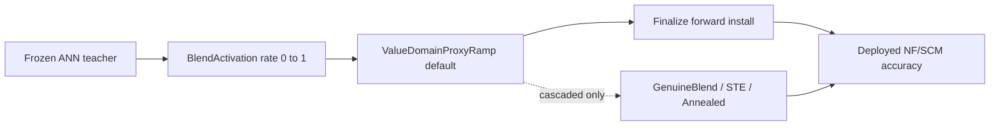

# Tuning Engineering — Post Phase-3 Conversion Stack

Engineering reference for the ANN→SNN conversion fine-tune subsystem. Read this before wiring the off-pipeline QAT recipe into production.

**Code SSOT:**

- [`src/mimarsinan/tuning/ARCHITECTURE.md`](../../src/mimarsinan/tuning/ARCHITECTURE.md)
- [`src/mimarsinan/tuning/orchestration/ARCHITECTURE.md`](../../src/mimarsinan/tuning/orchestration/ARCHITECTURE.md)
- [`src/mimarsinan/chip_simulation/spiking_mode_policy.py`](../../src/mimarsinan/chip_simulation/spiking_mode_policy.py)
- [`src/mimarsinan/tuning/orchestration/ttfs_adaptation_plan.py`](../../src/mimarsinan/tuning/orchestration/ttfs_adaptation_plan.py)

Historical recipe evidence (not production): [`docs/research_artifacts_for_cascaded_ttfs_tuning/`](../research_artifacts_for_cascaded_ttfs_tuning/)

---

## 1. Conversion model

The shared ANN→SNN path (`KDBlendAdaptationTuner`, used by LIF and TTFS) walks a **blend rate** from 0→1:

1. **Rate 0:** frozen ANN teacher (eval snapshot via `teacher.py`)
2. **Rate 0→1:** gradual ramp with KD loss `α·CE + (1−α)·T²·KL(teacher‖student)`
3. **Rate 1:** finalize installs the **deployed forward** (LIF chip-aligned NF; TTFS cascaded: segment-spike forward)
4. **Post-finalize:** stabilization rounds (default 3 for KD-blend family)



### Proxy vs genuine

| Path | Training forward | At rate=1 | Deployed accuracy |
|---|---|---|---|
| **Value-domain proxy** (default) | Per-perceptron `BlendActivation` through class forward | Proxy composition | **May cliff** at finalize (proxy ≠ cascade) |
| **Genuine cascade ramps** (opt-in, cascaded only) | Real fire-once-latch segment dynamics | Matches deploy | Trains through actual spiking forward |

**Synchronized TTFS:** ramped class forward **already IS deployment** (analytical staircases per group). `_finalize_forward_for` returns `None` — no cascade forward install. Always uses `ValueDomainProxyRamp`.

**Cascaded TTFS:** proxy during ramp; finalize installs `_SegmentSpikeForward`. Creates a **proxy↔genuine cliff** measurable via `_full_transform_eval` / `tuning_full_transform_probe`.

Detection in tuner:

```python
self._synchronized = contract.training_forward_kind() != "segment_spike"
```

(`ttfs_cycle_adaptation_tuner.py`)

---

## 2. SpikingModePolicy (firing × sync)

SSOT: [`spiking_mode_policy.py`](../../src/mimarsinan/chip_simulation/spiking_mode_policy.py)

| Policy | Schedule | `training_forward_kind` | Conversion-health calibration |
|---|---|---|---|
| `TtfsSyncCycleModePolicy` | synchronized | `analytical_staircase` | **Inert** |
| `TtfsCascadeModePolicy` | cascaded | `segment_spike` | **Enabled** (gain, θ-cotrain, distmatch, boundary-STE) |
| `LifModePolicy` | — | `lif_cycle` / `rate` | Inert |

### What synchronized **disables**

Resolved in `TtfsAdaptationPlan.resolve()` — all gated `and not synchronized`:

```101:111:src/mimarsinan/tuning/orchestration/ttfs_adaptation_plan.py
        annealed = bool(get("ttfs_genuine_annealed_ramp", False)) and not synchronized
        blend = bool(get("ttfs_genuine_blend_ramp", False)) and not synchronized
        if blend:
            annealed = False  # blend wins over annealed
        ste = (
            bool(get("ttfs_staircase_ste", False))
            and not synchronized and not blend
        )
        if ste:
            annealed = True  # the STE reuses the annealed cascade-forward install
```

Via `CalibrationPipeline.for_mode()` — synchronized gets `CalibrationPipeline.inert()`:

- `ttfs_gain_correction`, `ttfs_theta_cotrain`, distmatch, `ttfs_boundary_surrogate`

**What synchronized still has:**

- Value-domain blend + KD (`kd_ce_alpha`, `kd_temperature`)
- Full controller loop (unless `optimization_driver=fast`)
- `TTFSInputGridQuantizer` STE on segment-entry perceptrons
- Optional `ttfs_finetune_kd_against_rung2`

**This is why CIFAR production sync runs cannot use the proven QAT recipe without a policy/plan change.**

---

## 3. Adaptation trifecta (TTFS)

Three orthogonal concerns resolved once in `TtfsAdaptationPlan.resolve()`:

| Concern | Class | Options |
|---|---|---|
| **Ramp strategy** | `RampStrategy` | `ValueDomainProxyRamp` (default), `GenuineAnnealedRamp`, `GenuineBlendRamp`, `StaircaseSteRamp` |
| **Optimization driver** | `OptimizationDriver` | `controller` (adaptive search + rollback) vs `fast` (fixed ladder via `fast_ladder.py`) |
| **Calibration pipeline** | `CalibrationPipeline` | Conversion-health steps keyed by `(firing × sync)` policy |

Entry point: `TtfsAdaptationPlan.resolve(config, synchronized=..., optimization_driver=..., calibration_resolver=...)`

TTFS tuner sets `self._*` fields from the plan in `_configure()`.

### Fast ladder (`FastLadderMixin`)

Opt-in via `optimization_driver=fast` or per-family flags (`lif_blend_fast`, `ttfs_genuine_blend_fast`, etc.):

- Walks fixed rate list with one shared optimizer + spanning LR schedule
- No per-cycle rollback / LR-find / recovery-to-target
- Post-finalize `_fast_stabilize` closes proxy↔genuine cliff
- **BN-freeze risk:** `fast_ladder.py` uses `model.train()` with live BatchNorm — see [06_NEXT_WORK.md](06_NEXT_WORK.md) P1

---

## 4. Config surface SSOT

Defaults in [`config_schema/defaults.py`](../../src/mimarsinan/config_schema/defaults.py). All new levers are **default-off** unless noted.

### Shared conversion / KD

| Key | Default | Purpose |
|---|---|---|
| `kd_ce_alpha` | `0.3` | CE weight in `α·CE + (1−α)·KD` |
| `kd_temperature` | `3.0` | KD softmax temperature |
| `activation_scale_quantile` | `0.99` | Per-layer activation scale clip |
| `tuning_budget_scale` | `1.0` | Scales recovery sample budget |
| `training_epochs` | `10` | ANN pretraining epochs |
| `optimization_driver` | `controller` | `controller` \| `fast` |

### Orchestration robustness (default-off)

| Key | Purpose |
|---|---|
| `tuning_keepbest_certified` | R7 non-destructive keep-best adaptation |
| `tuning_target_floor_on_real_target` | Anchor target on real pipeline metric |
| `tuning_use_paired_sensor` | Paired McNemar rollback gate |
| `tuning_full_transform_probe` | Log proxy vs genuine drop |
| `conversion_policy` | E4 keystone: propose → confirm → escalate |

### TTFS cascaded-only levers (default-off)

| Key | Ramp / calibration |
|---|---|
| `ttfs_genuine_blend_ramp` | Genuine blend ramp |
| `ttfs_genuine_annealed_ramp` | Bare TTFS + surrogate anneal |
| `ttfs_staircase_ste` | Deploy-exact forward, STE backward |
| `ttfs_gain_correction` | Conversion-health calibration |
| `ttfs_theta_cotrain` | Per-channel θ co-training |
| `ttfs_genuine_blend_fast` | Fast ladder on genuine blend |
| `ttfs_staircase_ste_fast` | STE at single rung 1.0 |

### LIF fast path

| Key | Purpose |
|---|---|
| `lif_blend_fast` | Fixed-ladder LIF conversion |
| `lif_blend_fast_stabilize_steps` | Post-finalize stabilization budget |

---

## 5. Tuning budget

SSOT: [`tuning/orchestration/tuning_budget.py`](../../src/mimarsinan/tuning/orchestration/tuning_budget.py)

```66:70:src/mimarsinan/tuning/orchestration/tuning_budget.py
        # Recovery budget is sample-based (≈ budget_scale × 1 epoch of data),
        # NOT step-based — raising budget_scale lengthens recovery, not the ramp.
        # Cap raised to 4000 so the common bs//4 default does not get pinned.
        spe_budget = int(float(steps_per_epoch) * float(budget_scale))
        max_training_steps = max(1, min(4000, spe_budget))
```

**Known limitation:** `tuning_budget_scale` scales **recovery** sample budget, not the gradual ramp duration. Measured: budget 4→40 changed gradual phase only 5.5s→7.4s while deployed accuracy stayed ~0.71–0.73 ([`data/03_budget_sweep.jsonl`](data/03_budget_sweep.jsonl)). The cap at 4000 steps and ramp step sizing in `smooth_adaptation_cycle.py` are suspects for a separate fix.

Statistical thresholds derive from `accuracy_se() = 0.5 / sqrt(eval_sample_count)`.

---

## 6. Test contracts

| Test file | Guards |
|---|---|
| `tests/unit/tuning/test_kd_loss_alpha_config.py` | `kd_ce_alpha` / `kd_temperature` threading (6 tests) |
| `tests/unit/tuning/test_ttfs_adaptation_plan.py` | Plan resolution, synchronized gating |
| `tests/unit/tuning/test_genuine_blend_ramp.py` | Genuine blend ramp behavior |
| `tests/unit/tuning/test_genuine_annealed_ramp.py` | Annealed ramp |
| `tests/unit/tuning/test_staircase_ste.py` | STE hedge |
| `tests/unit/tuning/test_gradual_tuning_levers.py` | Gradual ramp invariants |
| `tests/unit/tuning/test_target_anchor.py` | Real-target floor |
| `tests/unit/tuning/test_lif_blend_fast.py` | LIF fast ladder |

**Default-off invariant:** unset config keys = historical hardcoded behavior (byte-identical regression suite: 1086+ tuning tests green at checkpoint).

---

## 7. Off-pipeline vs production gap

The proven CIFAR recipe ([`deep_residual_lif_deploy_fix.md`](../research/findings/deep_residual_lif_deploy_fix.md)) uses `probe_lif_qat_fix_study.py`:

| Capability | Probe | Production sync path |
|---|---|---|
| BN frozen to `.eval()` during QAT | Yes | No (train/eval mismatch measured: max\|diff\| 6.94) |
| Genuine LIF cascade forward | Yes | Proxy blend only |
| 400+ QAT steps with KD+CE | Yes | ~6s gradual ramp (~8 rungs × tiny steps) |
| Objective | CE load-bearing + KD additive | Fixed `α=0.3` KD-heavy (now configurable, refuted on CIFAR) |

**Reference implementation:** `probe_lif_qat_fix_study.py` reuses `probe_lif_resnet_decision_fidelity.py` for the ResNet vehicle; production uses `deep_cnn` plain conv stack.

---

## 8. Key file index

| Concern | File |
|---|---|
| KD-blend base | `tuning/orchestration/kd_blend_adaptation_tuner.py` |
| TTFS tuner | `tuning/tuners/ttfs_cycle_adaptation_tuner.py` |
| LIF tuner | `tuning/tuners/lif_adaptation_tuner.py` (via blend family) |
| Ramp strategies | `tuning/orchestration/ramp_strategy.py` |
| Smooth adaptation loop | `tuning/orchestration/smooth_adaptation_cycle.py` |
| Rate scheduler | `tuning/orchestration/rate_scheduler.py` |
| Adaptation driver | `tuning/orchestration/adaptation_driver.py` |
| Blend rate SSOT | `tuning/perceptron_rate.py` (`set_blend_rate`) |
| Config defaults | `config_schema/defaults.py` |
