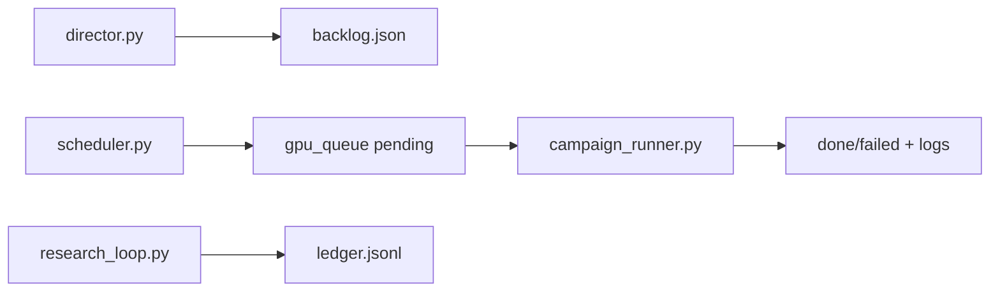

# Campaign Operations & Reproduction

Operational runbook for running experiments and reproducing checkpoint measurements.

**Architecture:** [`scripts/campaign/ARCHITECTURE.md`](../../scripts/campaign/ARCHITECTURE.md)

---

## 1. Reproduction contract

### Environment

```bash
cd /path/to/mimarsinan
source env/bin/activate
export MIMARSINAN_DISABLE_FFCV=1   # REQUIRED for CIFAR/ImageNet data paths
```

`ffcv` is not installed. Without the kill-switch, CIFAR runs crash at Pretraining with `No module named ffcv`.

### Running the pipeline

From **project root**:

```bash
env/bin/python run.py --headless path/to/config.json
```

### Reading metrics

| Metric | Source |
|---|---|
| **ANN accuracy** | `[PROFILE] step='Activation Analysis' ... metric=` log line |
| **Deployed SNN accuracy** | `generated/<experiment_name>_phased_deployment_run/__target_metric.json` |

Do not confuse pre-deployment step metrics with deployed parity-gated accuracy.

### Return codes

| `rc` | Meaning |
|---|---|
| `0` | Full pipeline passed 85% retention gate |
| `1` | Gate rejected (often TTFS fine-tune retention assertion). If `last_step≈Activation Analysis`, the deployed value in JSONL is the **genuine spiking accuracy at that step** — report rc=0 and rc=1 numbers distinctly |

---

## 2. Campaign topology



| Daemon | Command (typical) | Role |
|---|---|---|
| Scheduler | `scheduler.py --hi 24 --poll 20` | Fills queue from backlog; runs validity + capacity gates |
| Campaign runner | `campaign_runner.py --poll 3 --max-per-gpu 2` | Drains queue on leased GPUs |
| Director | `director.py --lo 16 --poll 30` | Grows backlog from ledger gaps |

**Runtime artifacts:** `runs/campaign/{backlog.json,q/,ledger.jsonl,logs/,harvest_todo.json}`

Stop sentinels: `SCHED_STOP`, `DIRECTOR_STOP`

---

## 3. Enqueue gates

Applied in `scheduler.py` before GPU claim:

1. **On-chip validity** (`onchip_precheck`) — tier INVALID rejected
2. **Capacity estimate** (`capacity_precheck`) — static lower bound
3. **Dry-run packer** (`capacity_dryrun_gate`) — real greedy packer oracle (~1s CPU)

Config keys: `capacity_gate`, `capacity_dryrun_gate` (both default on). Opt out dry-run only: `"capacity_dryrun_gate": false`.

**Doc:** [04_MAPPING_AND_VALIDITY.md](04_MAPPING_AND_VALIDITY.md) §2

---

## 4. GPU leases

| Tool | Path |
|---|---|
| Lease acquire | `scripts/gpu/gpu_lease.py` |
| Single-job wrapper | `scripts/gpu/with_gpu.py` |
| Queue | `scripts/gpu/gpu_queue.py` |

### Gotchas

- **Orphan `run.py`:** killing a sweep driver does NOT kill child `run.py`. Orphan keeps GPU >5% util → "free" lease blocks. Kill child PID explicitly.
- **Stale leases:** clear from `/dev/shm/mim_gpu_leases_<uid>/` if pid is dead
- **Clean detach:** `setsid env/bin/python ... & disown` in a standalone command

---

## 5. F-harness experiment matrices

Generator: [`scripts/campaign/experiment_matrix.py`](../../scripts/campaign/experiment_matrix.py)

| Study | Purpose |
|---|---|
| **F1** | Multi-seed CIs on default matrix |
| **F2** | `activation_scale_quantile` 0.99 vs 1.0 head-to-head |
| **F3** | from_scratch vs pretrained (SqueezeNet on CIFAR10 only) |
| **B2** | CIFAR breadth: deep_cnn + lenet5 on CIFAR10/100 |

```bash
# Generate B2 backlog batches (writes JSON file only)
env/bin/python scripts/campaign/experiment_matrix.py generate --study cifar --out /tmp/b2_backlog.json
```

CIFAR configs reuse MNIST templates with `data_provider_name` swapped via grid — no separate CIFAR template file required.

---

## 6. Research loop & ledger

```bash
# Append a result row
env/bin/python scripts/campaign/research_loop.py ledger-append --record '{...}'

# Coverage report
env/bin/python scripts/campaign/coverage_report.py --ledger runs/campaign/ledger.jsonl
```

### Ledger gap (checkpoint honesty)

CIFAR fidelity sweeps in `data/*.jsonl` ran as **direct GPU-leased** `run.py` invocations, not through the campaign harvest path. They are **not yet** in `runs/campaign/ledger.jsonl`. To integrate:

1. Run `research_loop.py ledger-append` with measured rows, or
2. Enable B2 backlog + harvest via director workflow

---

## 7. Safe merge during active campaigns

Never resolve conflicts in the runner's live checkout. Use:

```bash
scripts/campaign/safe_merge.sh <conflict-free-branch>
```

Pauses runner, merges, resumes. See A4 guards in [`guards.py`](../../scripts/campaign/guards.py).

---

## 8. Reproduction scripts

Persisted drivers in [`repro/`](repro/):

| Script | Sweeps |
|---|---|
| `run_single_smoke.sh` | One CIFAR-10 d4 sync cell (~8 min GPU) |
| `run_cifar_baseline_grid.sh` | Full 8-cell baseline |
| `run_ttfs_T_sweep.sh` | T ∈ {8,16,32,64} |
| `run_alpha_q_sweep.sh` | α, q, LIF baseline |
| `run_budget_sweep.sh` | budget/epochs variants |

Details: [repro/README.md](repro/README.md)

---

## 9. Campaign state at checkpoint time

- Queue drained (0 pending/running)
- ~805 done, ~483 failed in historical campaign
- GPUs may be saturated by other tenants
- Research-round workflow may return "no clean unanalyzed science" — genuine idle, not a bug

For live status see [`docs/research/CAMPAIGN_STATUS.md`](../research/CAMPAIGN_STATUS.md) (may be stale relative to checkpoint date).
