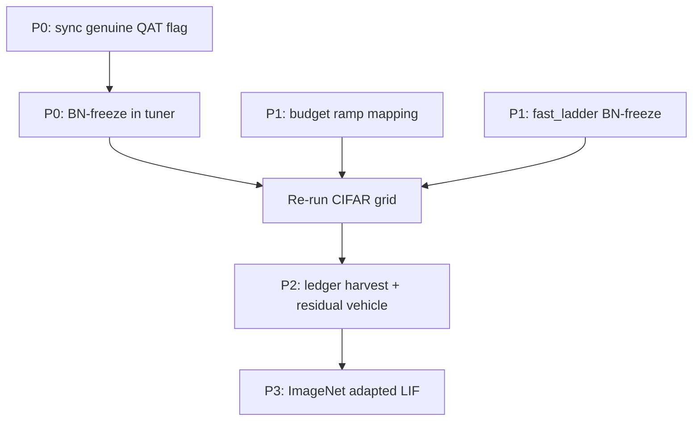

# Next Work — Engineering Tickets

Prioritized tickets derived from measured gaps in [05_MEASURED_RESULTS.md](05_MEASURED_RESULTS.md). Each links a **reference implementation** (probe) where applicable.

---

## P0 — Wire genuine-cascade QAT into production

**Problem:** Production synchronized fine-tune uses value-domain proxy ramp and force-disables genuine-cascade QAT toolkit ([02_TUNING_ENGINEERING.md](02_TUNING_ENGINEERING.md) §2). Off-pipeline QAT reaches ≥0.9 dec-fid on CIFAR residual ResNet.

**Entry files:**

- [`ttfs_adaptation_plan.py`](../../src/mimarsinan/tuning/orchestration/ttfs_adaptation_plan.py) — remove or gate `and not synchronized` for QAT-relevant flags
- [`kd_blend_adaptation_tuner.py`](../../src/mimarsinan/tuning/orchestration/kd_blend_adaptation_tuner.py) — BN-freeze during QAT phases
- [`spiking_mode_policy.py`](../../src/mimarsinan/chip_simulation/spiking_mode_policy.py) — optional synchronized genuine training forward
- New config flag (default-off): e.g. `ttfs_sync_genuine_qat` or reuse `ttfs_genuine_blend_ramp` with policy change

**Reference:** `probe_lif_qat_fix_study.py` (`qat_finetune`, BN freeze, KD+CE objective)

**Acceptance criteria:**

- [ ] Tests-first: unit tests for synchronized opt-in genuine path; default-off byte-identical
- [ ] CIFAR-10 d4 synchronized re-run: deployed ≥ 0.85 × ANN (currently 0.70/0.796)
- [ ] NF↔SCM per-neuron mismatch remains 0.0000%
- [ ] Full tuning regression suite green

---

## P0 — Enable QAT path for synchronized schedule

**Problem:** `TtfsAdaptationPlan.resolve()` hard-blocks all genuine ramps when `synchronized=True`. Even with flags set, production cannot train through genuine spiking forward on sync.

**Entry files:** same as above + [`ttfs_cycle_adaptation_tuner.py`](../../src/mimarsinan/tuning/tuners/ttfs_cycle_adaptation_tuner.py)

**Acceptance criteria:**

- [ ] Config flag enables genuine training forward for synchronized without breaking analytical-staircase deploy parity
- [ ] `test_ttfs_adaptation_plan.py` covers new resolution branch
- [ ] Document which conversion-health steps apply (likely inert for sync)

---

## P1 — Fix budget → ramp-steps mapping

**Problem:** `tuning_budget_scale` scales recovery samples, not gradual ramp duration. budget=40 produced same ~7.4s ramp as budget=4 ([`data/03_budget_sweep.jsonl`](data/03_budget_sweep.jsonl)).

**Entry files:**

- [`tuning_budget.py`](../../src/mimarsinan/tuning/orchestration/tuning_budget.py) — `max_training_steps` cap at 4000
- [`smooth_adaptation_cycle.py`](../../src/mimarsinan/tuning/orchestration/smooth_adaptation_cycle.py) — gradual accumulation
- [`rate_scheduler.py`](../../src/mimarsinan/tuning/orchestration/rate_scheduler.py) — ladder step sizing

**Acceptance criteria:**

- [ ] `tuning_budget_scale=40` yields materially longer gradual phase (>2× wall time vs scale=4 on CIFAR)
- [ ] Re-run budget sweep; document whether extended ramp changes deployed ceiling
- [ ] Default scale=1 behavior unchanged (byte-identical)

---

## P1 — BN-freeze in fast_ladder LIF path

**Problem:** `fast_ladder.py` uses `model.train()` with live BatchNorm. Deep-residual probe measured train/eval forward mismatch (max|diff| 6.94, 28% argmax flips) that hurt QAT until BN was frozen.

**Entry file:** [`fast_ladder.py`](../../src/mimarsinan/tuning/orchestration/fast_ladder.py) (~line 244)

**Acceptance criteria:**

- [ ] Fast LIF path freezes BN to eval during ramp/stabilize (configurable default matching probe behavior)
- [ ] `test_lif_blend_fast.py` extended
- [ ] No regression on MNIST fast-recipe certified cells

---

## P2 — Residual deep_cnn vehicle

**Problem:** Deep-residual finding showed skip connection is **protective** for conversion. Plain `deep_cnn` may convert far worse than residual variant even with current pipeline.

**Entry files:**

- Model builder under `src/mimarsinan/models/`
- Campaign template + B2 matrix extension

**Acceptance criteria:**

- [ ] Residual deep_cnn builder + template
- [ ] CIFAR-10 d4/d6 synchronized comparison: plain vs residual on same seeds
- [ ] Results appended to ledger

---

## P2 — Harvest CIFAR into ledger

**Problem:** Checkpoint JSONL data not in `runs/campaign/ledger.jsonl`.

**Entry:** [`research_loop.py`](../../scripts/campaign/research_loop.py) `ledger-append`

**Acceptance criteria:**

- [ ] All 8 baseline + lever sweep cells have ledger rows with `verdict: MET|BOUNDED-GAP|FAIL`
- [ ] `coverage_report.py` reflects CIFAR dataset axis

---

## P3 — ImageNet adapted LIF run

**Problem:** ResNet-50 ANN 71.97% measured; naive LIF deploy = chance; adapted accuracy unmeasured ([F4_imagenet_resnet50.md](../research/findings/F4_imagenet_resnet50.md)).

**Entry files:**

- [`templates/imgnet_resnet50_pretrained.json`](../../templates/imgnet_resnet50_pretrained.json)
- Deploy via NF path (memory-bounded) not 138K-core materialization

**Acceptance criteria:**

- [ ] First non-null `deployed_acc` on official val slice after LIF adaptation
- [ ] Document wall time and retention vs 71.97% ANN
- [ ] NF↔SCM parity held

---

## P3 — LIF production default budget

**Problem:** LIF deep_cnn d4 CIFAR at default budget: deployed 0.141 (−65.6pp). Needs stabilization budget (400→6000 steps per prior MNIST work).

**Tied to:** P0 QAT wiring + P1 budget mapping

**Acceptance criteria:**

- [ ] Default or campaign template budget sufficient for LIF to exceed chance on CIFAR-10
- [ ] Document LIF vs TTFS budget sensitivity in [05_MEASURED_RESULTS.md](05_MEASURED_RESULTS.md)

---

## Deferred / out of scope for immediate sprint

| Item | Rationale |
|---|---|
| Cascaded mode on natural images | −23..−30pp; synchronized is only viable schedule above MNIST |
| CIFAR-100 full rescue | Blocked on P0 conversion method |
| Spiking-aware training from scratch | Larger architectural change |
| Merge probe scripts to production | Probes remain reference until P0 lands |

---

## Suggested execution order

