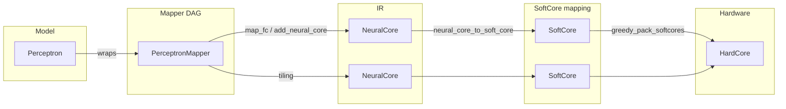

# Perceptron Packaging Mechanism

This document explains how a single fully-connected (FC) plus activation layer in the model—a **perceptron**—is turned into one or more hardware crossbar cores (or a host-side linear op), and how logical cores are packed into physical chip cores.

## Introduction

**Perceptron packaging** is the process of taking a logical Perceptron (one FC layer plus normalization and activation) and deciding where it runs: on the SNN chip as one or more **NeuralCores** (crossbar primitives), or on the host as a **ComputeOp**. When it runs on the chip, the layer may be **tiled** (split across multiple cores) if it exceeds hardware limits (e.g. `max_neurons`, `max_axons`). The resulting logical cores (**SoftCores**) are then **packed** into a finite pool of physical **HardCores** so that many small layers can share the same hardware. This document walks through that pipeline from the model to the final placement.

## The logical Perceptron

The unit we package is the [Perceptron](../src/mimarsinan/models/perceptron_mixer/perceptron.py) module: a linear layer (`nn.Linear`) plus optional normalization, scaling, and a nonlinear activation. It exposes scales used for mapping and simulation (`parameter_scale`, `input_activation_scale`, `activation_scale`) and a **base activation** (e.g. ReLU, GELU, Identity). That base activation determines whether the layer can be implemented on the chip’s crossbar or must stay on the host.

## Chip vs host: what can be packaged

Not every perceptron can be implemented as a chip crossbar. A single rule determines chip packaging:

**All patterns in the compute graph that match the flow `MM+ → BN? → ACT` can be packaged as a chip perceptron**, where:

- **MM+**: one or more ops representable as matrix multiplications, normalized into a single MM by [`graph_normalization`](../src/mimarsinan/torch_mapping/graph_normalization.py). Consecutive Linears connected through Identity and/or BatchNorm are fused: BN (a diagonal MM) is folded into the preceding Linear, then the pair is fused into a single Linear (e.g. `Linear → BN → Linear`, `Linear → Identity → Linear`).
- **BN?**: optional batch normalization.
- **ACT**: any detected nonlinear activation (ReLU, GELU, LeakyReLU, etc.). The adaptation pipeline converts all of them to LeakyGradReLU before deployment. When no activation is detected, the layer gets `Identity` and becomes a host-side linear ComputeOp.

A single predicate in [`base.py`](../src/mimarsinan/mapping/mappers/base.py) controls the packaging decision:

- **[`is_perceptron_activation()`](../src/mimarsinan/mapping/mappers/base.py)** — Returns `True` if the perceptron has a real (non-Identity) activation. Uses `isinstance` check, not a hardcoded activation set. Any nonlinearity maps to a NeuralCore; Identity maps to a host-side ComputeOp.

## Mapper DAG and perceptron ownership

The model is represented as a DAG of **mappers**. Each [PerceptronMapper](../src/mimarsinan/mapping/mappers/perceptron.py) wraps a single Perceptron and implements both forward execution and IR mapping. The method [`owned_perceptron_groups()`](../src/mimarsinan/mapping/mappers/perceptron.py) returns either a single group containing that perceptron (for nonlinear activations) or an empty list (for Identity/host-side activations).

The [ModelRepresentation](../src/mimarsinan/mapping/model_representation.py) builds the mapper graph and provides:

- **`get_perceptron_groups()`** — perceptron groups in forward-topological order (used e.g. for scale propagation).
- **`get_perceptrons()`** — flattened list of perceptrons in that order.
- **`assign_perceptron_indices()`** — sets `perceptron_index` on each mapper that owns perceptrons, in the same order. This index is passed through to the IR so that pruning and tooling can associate each NeuralCore (or tile) with the original perceptron.

## From mapper to IR: NeuralCores

When the deployment pipeline runs, it obtains the mapper representation, calls `assign_perceptron_indices()`, then calls `IRMapping.map(mapper_repr)`. That walks the DAG; for each [PerceptronMapper](../src/mimarsinan/mapping/mappers/perceptron.py), `_map_to_ir()` is invoked.

For **chip-supported** perceptrons, it calls [IRMapping.map_fc()](../src/mimarsinan/mapping/ir_mapping.py) with the layer’s effective weights and biases (from `PerceptronTransformer`) and scales. Behavior:

- **Single core**: If the layer fits within `max_neurons` (and, for width, any axon limit is handled later by packing), [add_neural_core](../src/mimarsinan/mapping/ir_mapping.py) is used once. The core may be “wide” (more axons than `max_axons`); hardware packing will later fuse multiple physical cores to cover the axon dimension.
- **Output tiling**: If `out_features > max_neurons`, [`_map_fc_output_tiled`](../src/mimarsinan/mapping/ir_mapping.py) splits the output dimension into chunks. Each chunk becomes a separate NeuralCore with `perceptron_output_slice` set, so pruning and tools know which part of the perceptron each core implements.
- **2D batch**: For a batch of independent FC applications (e.g. one per token), the input sources have shape `(in_features, core_count)`. `map_fc` dispatches per column and produces one NeuralCore per column.

Each created NeuralCore stores `perceptron_index` and, when tiled, `perceptron_output_slice` (and optionally `perceptron_input_slice` for psum-style tiling), so the whole chain from perceptron → IR remains traceable.

## IR to SoftCores

The IR is a graph of **NeuralCore** and (for host-only layers) **ComputeOp** nodes. To run the classic packing path, the graph must be **neural-only** (no ComputeOps). [ir_graph_to_soft_core_mapping](../src/mimarsinan/mapping/ir.py) converts the IR graph into a **SoftCoreMapping**:

- For each NeuralCore, [neural_core_to_soft_core](../src/mimarsinan/mapping/ir.py) builds one **SoftCore**: same weight matrix (or materialized from a shared `WeightBank`), axon sources (from IR sources), scales, and optional pruning masks. So after any tiling done in the IR, the mapping is one NeuralCore → one SoftCore.

SoftCores are the logical cores that the packer places. If the graph contains ComputeOps, this conversion is not used; unified/hybrid flows handle simulation without going through SoftCore packing.

## Packing SoftCores into HardCores

[HardCoreMapping.map()](../src/mimarsinan/mapping/softcore_mapping.py) takes a SoftCoreMapping and a pool of **HardCores** (each with fixed `axons_per_core` and `neurons_per_core`). It uses [greedy_pack_softcores](../src/mimarsinan/mapping/core_packing.py) to assign SoftCores to HardCores:

- **Used-core selection**: Among HardCores that already have some SoftCores and that can fit the next SoftCore (by axon/neuron count, threshold, and latency), the algorithm picks the one with the **smallest remaining capacity** after placement. That keeps cores filled and reduces fragmentation.
- **Unused-core selection**: When no used core fits, it picks an unused HardCore using **scarcity-adjusted waste**: the placement waste (an L-shaped unused region under diagonal packing) is divided by how many cores of that type remain. That preserves scarce hardware for layers that need it.
- **Diagonal packing**: Multiple SoftCores can share one HardCore, each occupying a block of axons × neurons.
- **Wide cores**: If a SoftCore has more axons than `max_axons`, the packer can **fuse** several HardCores into one logical core that spans the required axon dimension; the mapping records this in `fused_component_axons` for GUI/overlay.

Traceability is kept in both directions: **neuron_mapping** (soft core id, neuron index) → (hard core index, neuron index), and **soft_core_placements_per_hard_core** (per hard core, list of placed soft cores with offsets and dimensions).

## End-to-end flow

One Perceptron is wrapped by one PerceptronMapper. That mapper may produce one or more NeuralCores (single core or tiled). Each NeuralCore becomes one SoftCore. The packer then places all SoftCores into a set of HardCores (possibly multiple SoftCores per HardCore, or fused HardCores for wide cores).

## Where it runs in the pipeline

Perceptron packaging is triggered from the **deployment pipeline**. The pipeline builds the mapper representation from the model, assigns perceptron indices, and calls `IRMapping.map()` to obtain an IR graph. For neural-only graphs, it then converts the IR to a SoftCoreMapping and runs HardCoreMapping to pack SoftCores into the configured pool of HardCores. The step that performs IR mapping and (when applicable) SoftCore conversion is [SoftCoreMappingStep](../src/mimarsinan/pipelining/pipeline_steps/soft_core_mapping_step.py); the step that builds the HardCoreMapping and runs the packer is part of the same pipeline. For the full sequence of steps and how they interact, see the root [ARCHITECTURE.md](../ARCHITECTURE.md).
