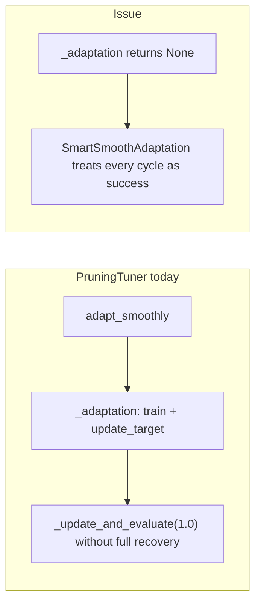

Firstly we are having a quantization verification error that needs to be investigated!

Traceback (most recent call last):
  File "/home/yigit/repos/mimarsinan/run.py", line 86, in _run_headless
    pipeline.run(stop_step=parsed["stop_step"])
  File "/home/yigit/repos/mimarsinan/src/mimarsinan/pipelining/pipeline.py", line 58, in run
    self._run_step(name, step)
  File "/home/yigit/repos/mimarsinan/src/mimarsinan/pipelining/pipeline.py", line 139, in _run_step
    step.run()
  File "/home/yigit/repos/mimarsinan/src/mimarsinan/pipelining/pipeline_step.py", line 15, in run
    self.process()
  File "/home/yigit/repos/mimarsinan/src/mimarsinan/pipelining/pipeline_steps/quantization_verification_step.py", line 49, in process
    assert torch.allclose(
           ^^^^^^^^^^^^^^^
AssertionError: tensor([[  0.0000,   0.0000,   0.1889,  ...,   0.0000,   1.0000,   0.3718],
        [ 50.0000, -41.0000,  27.0000,  ...,  21.0000,  17.0000, -24.0000],
        [  1.0000,   1.0000,   1.0000,  ...,  -1.0000,  -1.0000,   1.0000],
        ...,
        [-37.0000,  38.0000,  22.0000,  ...,  74.0000,  38.0000, -24.0000],
        [ 23.0000, -35.0000,   0.0000,  ...,  17.0000,  17.0000,  64.0000],
        [ -0.0000,   0.0000,   1.0000,  ...,   0.0000,  -0.2074,  -0.0000]],
       device='cuda:0')

# Tuning work: summary and next steps

## What was actually changed (current codebase)

### Core adaptation loop
- **[`smart_smooth_adaptation.py`](src/mimarsinan/tuning/smart_smooth_adaptation.py)**  
  Rollback-aware loop: on failed adaptation, `t` resets to the committed rate and `rate_ceiling` bisects so the search cannot re-propose catastrophic rates indefinitely.
- **[`unified_tuner.py`](src/mimarsinan/tuning/unified_tuner.py)**  
  - `_adaptation`: rollback when `post_acc < target * (1 - rollback_tolerance)`; returns committed rate for the outer loop.  
  - `TOLERANCE_SAFETY_FACTOR` (0.5) scales calibrated tolerance.  
  - Budget-aware `max_cycles` for `SmartSmoothAdaptation`.  
  - **`SmoothAdaptationTuner.__init__`**: initializes `_committed_rate` and a default `_rollback_tolerance` (so hooks that call `_adaptation` without a full `run()` are less fragile).  
  - **`_continue_to_full_rate()`**: after the main loop, walks from `_committed_rate` toward `1.0` using repeated `_adaptation()` calls with step halving on rollback—intended to avoid a **one-shot jump** to full transformation when the main loop exits early (e.g. ViT GELU → chip ReLU path).

### LR discovery
- **[`learning_rate_explorer.py`](src/mimarsinan/tuning/learning_rate_explorer.py)**  
  Baseline validation before probes; if best smoothed accuracy `< 0.9 * baseline`, return `lr_min` (conservative). Tie-breaking and smoothing retained.

### Budget
- **[`tuning_budget.py`](src/mimarsinan/tuning/tuning_budget.py)**  
  `lr_steps_per_probe = max(1, check_interval)` (reverted from a heavier formula to keep tests/runtime reasonable).

### Tuners: post-loop commit
- **[`activation_adaptation_tuner.py`](src/mimarsinan/tuning/tuners/activation_adaptation_tuner.py)**  
  `_after_run()` calls `_continue_to_full_rate()` **before** setting `base_activation` to `make_activation("ReLU")` and `activation_adaptation_rate = 0`, then recovery training. Addresses the **CIFAR ViT collapse** observed when the smooth loop stopped around ~0.28 and then committed as if at rate `1.0` in one conceptual step.
- **[`clamp_tuner.py`](src/mimarsinan/tuning/tuners/clamp_tuner.py)**, **[`activation_quantization_tuner.py`](src/mimarsinan/tuning/tuners/activation_quantization_tuner.py)**, **[`noise_tuner.py`](src/mimarsinan/tuning/tuners/noise_tuner.py)**  
  Same `_continue_to_full_rate()` before forcing rate `1.0` + recovery.

### Tests / tooling
- Unit tests updated for rollback behavior, LR baseline, tuning budget, pruning cycle count (mock `training_epochs` to shrink `min_step`).  
- Some full-suite slowness comes from **unmarked** heavy tests (e.g. joint-arch eval with real MNIST training, slow concat clamp test).

---

## What the evidence showed (pipelines)

| Area | Observation |
|------|-------------|
| **CIFAR ViT** | Smooth adaptation held ~0.79–0.80, then **0.1** after commit; root cause aligned with **partial rate then hard commit** in `_after_run` (now mitigated by `_continue_to_full_rate`). |
| **MNIST** | Metrics showed **large drop late in pruning** (e.g. test acc stepping down through many cycles toward ~0.907), not only “30% pruning is inherently -5%”. |
| **Quantization verification** | Separate failure (tensor assert in [`quantization_verification_step.py`](src/mimarsinan/pipelining/pipeline_steps/quantization_verification_step.py))—not the same class of bug as tuning loops. |

---

## Your correction on pruning (“not expected”)

Earlier reasoning that “~5% from 30% pruning is normal” **does not match your experience** (you previously saw **~0% drop** with proper cycles). The code supports a more precise hypothesis:

1. **`PruningTuner._adaptation` does not return a value**  
   In [`smart_smooth_adaptation.py`](src/mimarsinan/tuning/smart_smooth_adaptation.py), `if result is not None and ...` means **`None` is always treated as success**. So **rollback semantics never apply** to pruning’s inner loop—the outer bisection cannot learn “this proposed rate failed.”

2. **Hard final step after the loop**  
   At the end of [`pruning_tuner.py`](src/mimarsinan/tuning/tuners/pruning_tuner.py) `run()`, `adapter.adapt_smoothly(...)` is followed by **`self._update_and_evaluate(1.0)`** without the **`train_steps_until_target`** recovery path that lives inside `_adaptation`. That is a **final discontinuity** at full prune rate.

3. **Target metric decay**  
   [`AdaptationTargetAdjuster`](src/mimarsinan/tuning/adaptation_target_adjuster.py) can pull the target down when post-metric drops; combined with (1)–(2), this can **encode a large drop as “acceptable”** over time.

Together, these explain **why “proper tuning cycles” could historically achieve near-zero drop** (tighter loop + real recovery at each rate) while the current path can show a **multi-point drop** at the end.

---

## Risks and gaps to close before declaring “done”

1. **`_continue_to_full_rate` vs `run()` tolerance**  
   `run()` overwrites `_rollback_tolerance` with **calibrated** tolerance; `_continue_to_full_rate` runs **after** that. If anything calls `_after_run` without `run()`, tolerance may still be the **static** initializer—tests and edge paths should be explicit.

2. **Cost**  
   `_continue_to_full_rate` can add **many** `_adaptation` calls (each = LR sweep + `train_steps_until_target`). Needs **caps**, logging, or sharing the same budget accounting as the main loop to avoid multi-hour steps on large datasets.

3. **Subclass `__init__`**  
   Adding `SmoothAdaptationTuner.__init__` is correct if **every** subclass uses `super().__init__(pipeline, model, target_accuracy, lr)`. Any subclass that bypasses it must be fixed or documented.

4. **Test suite**  
   Last run showed **timeouts** on long tests; need a **deterministic** subset (`-m "not slow"`) and/or marking slow integration tests.

---

## Recommended next steps (ordered)

### 1. Pruning: restore parity with rollback-aware adaptation
- Make **`PruningTuner._adaptation` return the committed rate** (or explicit rollback signal) consistent with [`SmoothAdaptationTuner._adaptation`](src/mimarsinan/tuning/unified_tuner.py): optional **state clone/restore** if post-training accuracy fails threshold (same target-based rule as other tuners, or pruning-specific threshold if justified).
- Replace or augment the **final `self._update_and_evaluate(1.0)`** with either:
  - a **final `_adaptation(1.0)`** (full recovery), or  
  - **`_continue_to_full_rate()`-style** continuation from last committed prune rate to `1.0` (reuse base helper if semantics match).
- Add a **unit test** that asserts: after a controlled mock sequence, **final test accuracy** is within a configurable tolerance of **pre-pruning** (or documents the contract if true zero-drop is only achievable with extended budget).

### 2. Activation adaptation: validate `_continue_to_full_rate` on real ViT
- Re-run **[`templates/cifar_vit_pretrained.json`](templates/cifar_vit_pretrained.json)** and inspect **`Test accuracy`** lines in `_GUI_STATE/live_metrics.jsonl` through Activation Adaptation and Clamp Adaptation.
- If still slow or unstable, consider **merging** continuation into the **same** `SmartSmoothAdaptation` instance (single `t` space) instead of a second phase loop, to avoid double LR-finder cost.

### 3. Targets and decay
- Audit **`AdaptationTargetAdjuster.update_target`** during pruning and activation steps: consider **floor** behavior, **monotonicity** w.r.t. original pipeline metric, or **separate “floor = original * (1 - degradation_tolerance)”** so erosion cannot normalize a collapse.

### 4. Quantization verification (MNIST failure)
- Treat as **orthogonal**: either fix fused weights vs integer grid, or relax verification to match actual quantization pipeline—**after** tuning metrics are trusted.

### 5. CI / developer workflow
- Ensure **default** `pytest` path is fast (mark or exclude known slow tests).  
- Document in [`ARCHITECTURE.md`](ARCHITECTURE.md) under tuning: `_continue_to_full_rate`, pruning return contract, and tolerance pipeline.

---

## Success criteria (aligned with your goals)

- **Templates** (`mnist_small_all`, `cifar_vit_pretrained`, `imgnet_sq_pretrained`): complete without **unexplained** step-to-step **accuracy cliffs**; tuning steps stay within **degradation_tolerance** (or documented exceptions).
- **Pruning**: measurable **retention** vs pre-prune **test** accuracy under the same budget scale you use in production—not dismissed as “inherent” without code-level explanation.
- **Tests**: green on a **CI-sized** subset; slow tests opt-in.
